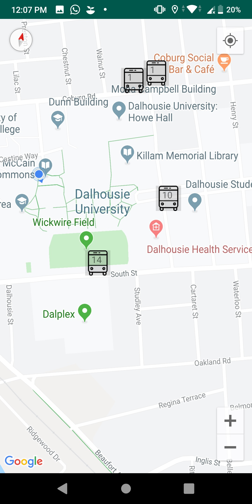

# Transit App 

Its a Transit app application. It is designed to serve for custom requirements as part of Assignment 3.

## Usage and Features

    - On launch, a map is displayed, overlaid with indicators showing the current positions of all
    or selected buses.
    - The marker for each bus includes the route number.
    - The positions of the buses are updated approximately every 15 seconds.
    - The user can choose to centre the map on his or her current location, e.g., with a standard
    button.
    - The user can zoom and pan the map freely.
    - When returning to the app, the map shows the same region it was showing when the app was
    paused or closed (even if the app is terminated and relaunched).
    -The map is made to show default location on start.
    -Application requests for location permissions on start.
    

## Known Limitation
    
    - Markers are not scalable according to the zoom factor.
    - I was Not able to hold-on onRequestPermissionResult until permissions are given or rejected by user. 
    - Location Permission is a MUST requirement devoid of which app wont work.
    - If GPS is not enabled when asked for, centering marker button would be disabled (as it works with that).

## References

    [1]H. bundle and C. Stratton, "How to send objects through bundle", Stack Overflow, 2019. [Online]. Available: https://stackoverflow.com/questions/4249897/how-to-send-objects-through-bundle/4253078. [Accessed: 15- Jul- 2019].

    [2]S. Android, M. Orlowski and m. nathar, "Save object reference to Bundle in Android", Stack Overflow, 2019. [Online]. Available: https://stackoverflow.com/questions/23683281/save-object-reference-to-bundle-in-android. [Accessed: 15- Jul- 2019].

    [3]A. map and T. Castelijns, "Android: Saving Map State in Google map", Stack Overflow, 2019. [Online]. Available: https://stackoverflow.com/questions/34636722/android-saving-map-state-in-google-map. [Accessed: 15- Jul- 2019].

    [4]A. Android, I. Bykov, G. Shur and A. Tech, "Adding multiple markers in Google Maps API v2 Android", Stack Overflow, 2019. [Online]. Available: https://stackoverflow.com/questions/30569854/adding-multiple-markers-in-google-maps-api-v2-android. [Accessed: 15- Jul- 2019].

    [5]H. [duplicate], J. Nath, A. Yus and M. Adil, "How to create a custom-shaped bitmap marker with Android map API v2", Stack Overflow, 2019. [Online]. Available: https://stackoverflow.com/questions/14811579/how-to-create-a-custom-shaped-bitmap-marker-with-android-map-api-v2. [Accessed: 15- Jul- 2019].

    [6]H. maps?, M. A, A. Pandian and K. Gera, "How to show enable location dialog like Google maps?", Stack Overflow, 2019. [Online]. Available: https://stackoverflow.com/questions/29801368/how-to-show-enable-location-dialog-like-google-maps. [Accessed: 15- Jul- 2019].

    [7]"Android Show Current Location On Map Example", Zoftino.com, 2019. [Online]. Available: https://www.zoftino.com/android-show-current-location-on-map-example. [Accessed: 15- Jul- 2019].

    [8]"Custom Marker icon using layout in Android. · Waleed Sarwar", Waleedsarwar.com, 2019. [Online]. Available: https://waleedsarwar.com/posts/2016-03-03-custom-markers-google-maps/. [Accessed: 15- Jul- 2019].

    [9]R. delay?, K. Welivitigoda, N. Beckman, K. Wang, X. Ahmer and G. Patel, "Repeat a task with a time delay?", Stack Overflow, 2019. [Online]. Available: https://stackoverflow.com/questions/6242268/repeat-a-task-with-a-time-delay. [Accessed: 15- Jul- 2019].

    [10]"MobilityData/gtfs-realtime-bindings", GitHub, 2019. [Online]. Available: https://github.com/MobilityData/gtfs-realtime-bindings. [Accessed: 15- Jul- 2019].

    [11]"Android app to Track your location using Google Map API", YouTube, 2019. [Online]. Available: https://www.youtube.com/watch?v=qS1E-Vrk60E. [Accessed: 15- Jul- 2019].

## License
### Aakash Patel - B00807065

